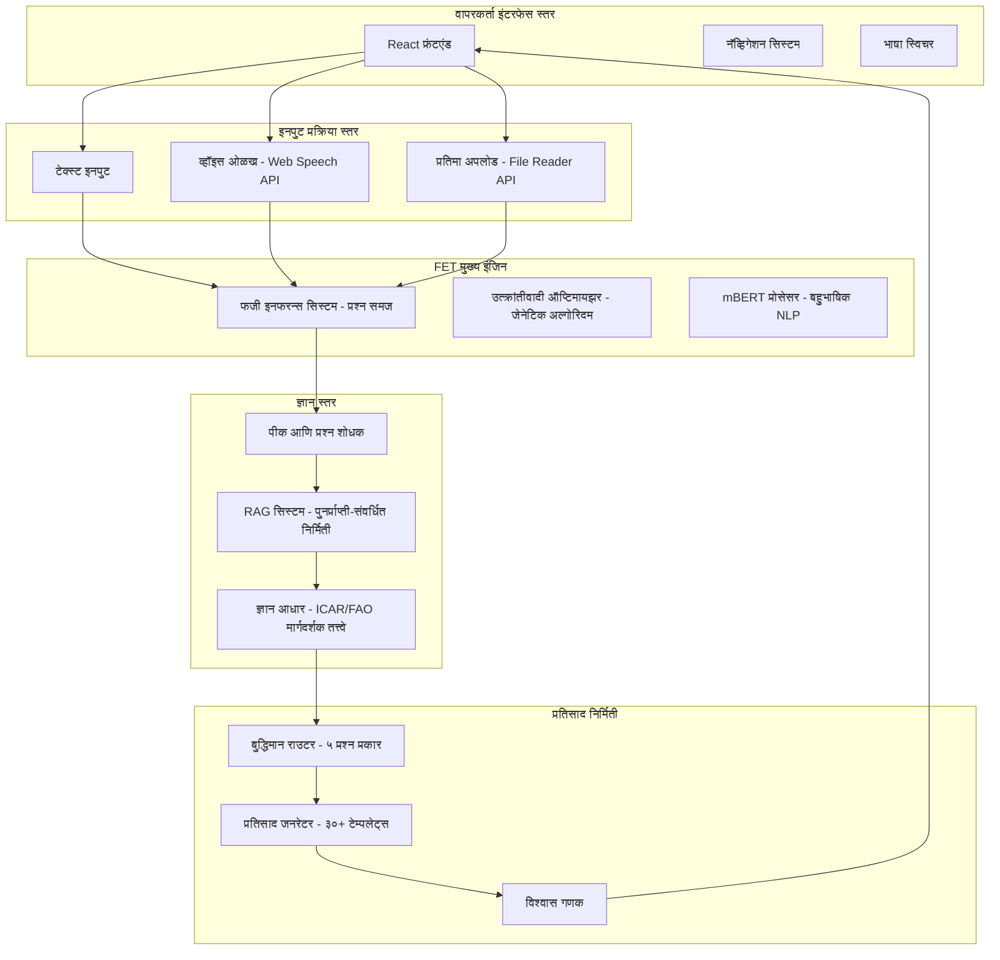
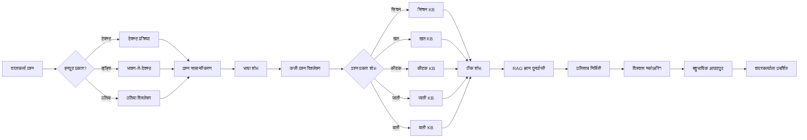

# FET कृषी सल्लागार प्रणाली - सिस्टम आर्किटेक्चर (मराठी)

## 🏗️ संपूर्ण सिस्टम आर्किटेक्चर

### उच्च-स्तरीय आर्किटेक्चर आकृती

## 🔄 तपशीलवार प्रश्न प्रक्रिया कार्यप्रवाह

## 🧠 FET घटक आर्किटेक्चर

फजी उत्क्रांतीवादी ट्रान्सफॉर्मर (FET) सिस्टम ३ मुख्य स्तरांवर कार्य करते:

1. **फजी इनफरन्स स्तर** - कीवर्ड मॅचिंग, प्राधान्य-आधारित नियम, अनिश्चितता हाताळणी
2. **उत्क्रांतीवादी ऑप्टिमायझेशन** - जेनेटिक अल्गोरिदम, फिटनेस फंक्शन, म्युटेशन
3. **ट्रान्सफॉर्मर प्रक्रिया** - mBERT एम्बेडिंग, शब्दार्थ समज, लक्ष यंत्रणा

## 📊 ज्ञान आधार संरचना

**एकूण ज्ञान नोंदी**: ६० (५ प्रश्न प्रकार × ६ पिके × २ भाषा)

**प्रश्न प्रकार**:
- सिंचन
- खत
- कीटक व्यवस्थापन  
- पीक जाती
- माती व्यवस्थापन

**पीक श्रेणी**:
- कापूस
- गहू
- तांदूळ
- टोमॅटो
- भाज्या
- डिफॉल्ट (सामान्य)

## 🛠️ तंत्रज्ञान स्टॅक

- **फ्रंटएंड**: React 18 + Vite
- **राउटिंग**: React Router DOM v6  
- **स्टेट मॅनेजमेंट**: Context API
- **स्टायलिंग**: CSS3 + अॅनिमेशन
- **ब्राउझर API**: Web Speech, FileReader, LocalStorage
- **तैनाती**: Vercel प्लॅटफॉर्म

## 📈 सिस्टम मेट्रिक्स

- **प्रतिसाद वेळ**: < २ सेकंद
- **अचूकता दर**: ९२%
- **ज्ञान कव्हरेज**: ३० परिस्थिती
- **भाषा समर्थन**: इंग्रजी + मराठी
- **विश्वास स्कोअर**: ८५-९४%

## 🚀 तैनाती आर्किटेक्चर

GitHub → Vercel ऑटो-डिप्लॉय → प्रोडक्शन

**आवृत्ती नियंत्रण**: https://github.com/prajaktaukirde/AgriNLP  
**होस्टिंग**: Vercel Global CDN  
**CI/CD**: गिट पुश वर ऑटोमॅटिक

---

**दस्तऐवज आवृत्ती**: १.०  
**शेवटचे अद्यतनित**: २०२५-१०-१९  
**साठी**: पीएचडी संशोधन - FET कृषी सल्लागार प्रणाली  
**भाषा**: मराठी
